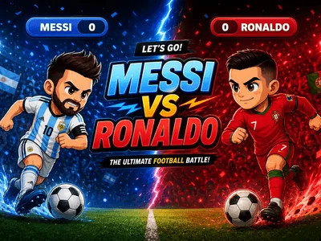
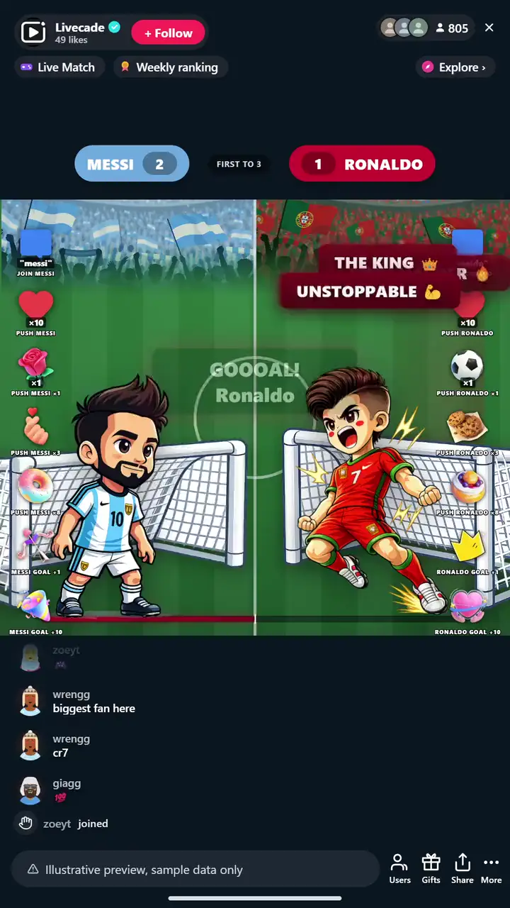

# Messi vs Ronaldo - Interactive TikTok Live Game

> One ball, two nets, your chat shoves it in for the goal.

A live football goal-battle. Two players guard nets at opposite touchlines and one ball sits between them. Viewers push their player with comments, likes, and gifts, and the bigger the gift the bigger the shove. Force the ball into the far net and it is a GOAL.

**[Play Messi vs Ronaldo on Livecade](https://livecade.io/games/messi-vs-ronaldo/?utm_source=github&utm_medium=readme&utm_campaign=messi-vs-ronaldo)** - runs as a single browser source in OBS, Streamlabs, or TikTok LIVE Studio. Nothing for viewers to install.

## How viewers play

Viewers take part with the actions TikTok already gives them: **comments**, **gifts**, **likes**. Every action below is rebindable, so you decide which interaction drives which effect.

| Action | What it does |
| --- | --- |
| **Join a side (per player)** | A comment adds the viewer to that player so their reactions count |
| **Like push (per player)** | A like nudges the ball toward the player the viewer joined |
| **Gift push (per player)** | Shoves the ball toward the far net in small, medium, or big steps |
| **Instant goal (per player)** | Banks a goal outright, +1 or +10 |

## How it works

### Viewers back a player

Two players guard the nets at opposite ends and one ball sits between them. Viewers join a side from chat and start shoving the ball toward the far goal.

### Every reaction is a shot

Comments and likes nudge the ball, gifts blast real shots, and the bigger the gift the harder the shove. Instant-goal gifts bank a point outright.

### Cross the line, score the goal

Push the ball all the way into a net and it is a goal, no keeper saves it. The ball recenters and goes again, endless or best of N for the match.

## About the game

Messi vs Ronaldo turns your chat into two rival stands. One ball, two nets, no keeper: viewers pick a player and every comment, like and gift shoves the ball toward the other goal.

### Cheap reactions nudge, big gifts blast

The moment the ball crosses the line it is a goal, the scorer erupts, the crowd roars, and the ball recenters for the next round.

### Make it your own match

Run it endless so the score climbs forever, or best of N for a match with a first-to target. Rename and recolor each side, and drop in your own background.

## What it looks like on stream

[Watch Messi vs Ronaldo gameplay](https://cdn.livecade.io/games/messi-vs-ronaldo.mp4)

## What you can configure

- **Interface language** - Twelve languages for the on-screen chrome
- **Player names and colors** - Rename and recolor each side
- **Match mode** - Best-of rounds or endless play
- **Rounds best-of** - How many rounds win the match
- **Effort to score a goal** - How far the ball has to travel to cross the line, lower is faster goals
- **Idle recenter** - Slowly drift the ball back to center when the room goes quiet
- **Background** - Transparent, a solid color, or your own image

## Languages

English, Spanish, Portuguese, French, German, Italian, Indonesian, Arabic, Turkish, Russian, Hindi, Romanian

## FAQ

<strong>How do viewers play Messi vs Ronaldo?</strong>

Viewers pick a player from your TikTok Live chat, then comments, likes, and gifts shove the ball toward the far net. Cross the line and it is a goal.

<strong>Do bigger gifts shoot harder?</strong>

Yes. Cheap reactions give a small nudge and big gifts blast a shot at the net, with instant-goal gifts that bank a point outright. Every trigger is rebindable to your own thresholds.

<strong>Can I change the players and colors?</strong>

You can rename and recolor each side and set your own background. The game runs in twelve languages for the overlay chrome.

<strong>How do I add Messi vs Ronaldo to my TikTok Live?</strong>

Add one browser source URL to OBS or your streaming software and go live. There is no plugin to install and nothing for your viewers to download.

## Setup

1. [Create a Livecade account](https://app.livecade.io/register?utm_source=github&utm_medium=cta&utm_campaign=messi-vs-ronaldo)
2. Copy your overlay browser source URL
3. Paste it into OBS, Streamlabs, or TikTok LIVE Studio
4. Pick Messi vs Ronaldo, set your triggers, and go live

Runs in the browser, so it works on Windows and macOS with nothing to download. [See all TikTok Live games](https://livecade.io/tiktok-live-games/?utm_source=github&utm_medium=readme&utm_campaign=messi-vs-ronaldo).

---

_This repository documents Messi vs Ronaldo, a hosted interactive game by [Livecade](https://livecade.io/?utm_source=github&utm_medium=footer&utm_campaign=messi-vs-ronaldo). The game runs on Livecade's platform, so there is no source to install here._
